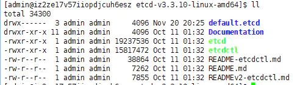
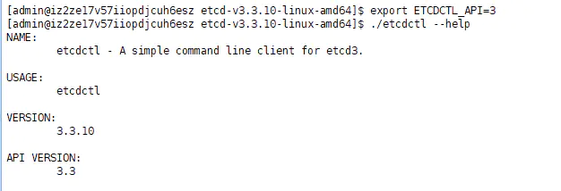

etcd的初步使用


etcd是一个golang编写的分布式、高可用的一致性键值存储系统，用于提供可靠的分布式键值(key-value)存储、配置共享和服务发现等功能。etcd可以用于存储关键数据和实现分布式调度，在现代化的集群运行中能够起到关键性的作用。

etcd基于raft协议，通过复制日志文件的方式来保证数据的强一致性。在etcd之前，常用的是基于paxos协议的zookeeper。

安装
可以通过下载源码自己编译，也可以下载编译好的二进制文件，这里选择编译好的。

下载页面：https://github.com/etcd-io/etcd/releases

选择合适的版本下载，实验机器系统是centos7，这里选择linux的版本: https://github.com/etcd-io/etcd/releases/download/v3.3.10/etcd-v3.3.10-linux-amd64.tar.gz

步骤如下：
```
# 下载
wget https://github.com/etcd-io/etcd/releases/download/v3.3.10/etcd-v3.3.10-linux-amd64.tar.gz 
# 解压
tar -zxvf etcd-v3.3.10-linux-amd64.tar.gz
cd etcd-v3.3.10-linux-amd64
```

其中`etcd`就是服务端程序，`etcdctl`是客户端程序。

启动服务端：
```
./etcd --listen-client-urls 'http://0.0.0.0:2379' --advertise-client-urls 'http://0.0.0.0:2379'
```
 - listen-client-urls：监听的用于客户端通信的url,可以监听多个。
 - advertise-client-urls：建议使用的客户端通信url。
可以看到，输出中有一行：


不建议监听任意地址的客户端，因为这样不够安全。这里只是为了测试方便才这么做。

客户端
etcdctl是官方提供的客户端程序。


`etcd`有两个版本的接口，v2和v3，且两个版本不兼容，v2已经停止了支持，v3性能更好。

`etcdctl`默认使用v2版本，如果想使用v3版本，可通过环境变量ETCDCTL_API=3进行设置。


接下来都使用v3接口进行学习，主要进行单机测试。

常见命令
get put del
最常见的就是`put`、`get`和`del`命令。
```
# 放入一个 键值对
$ ./etcdctl get name
name
zyq
# 取出 name
$ ./etcdctl get name
name
zyq
# 删除 name
$ ./etcdctl del name
1
# 在获取name
$ ./etcdctl get name
# 什么都没拿到
```
`etcd`的`key`是有序存储的，本质上是字符串，可以模拟出目录的结构，例如存储了`/a/b`，`/a/b/c`，`/a/b/d`三个`key`，由于它们在存储中顺序排列的，通过定位到`key=/a/b`并依次顺序向后扫描，就会遇到`/a/b/c`与`/a/b/d`这两个孩子，从而实现父子目录关系。

所以一般都将`etcd`的`key`设计成目录结构。

`etcdctl`的`get`命令可以获取单个`key`，也可以获取以某个字符串为前缀的`key`（可以模拟某个目录下的所有`key`)。


```
$ ./etcdctl put "/project/jobs/job1" "{...job1}"
OK
$ ./etcdctl put "/project/jobs/job2" "{...job2}"
OK
# 可以单独获取某个key
$ ./etcdctl get "/project/jobs/job1"
/project/jobs/job1
{...job1}

# 也可以获取某个目录下的所有key
# 但是直接获取某个目录 etcd是不认识的 因为它没有目录的概念
$ ./etcdctl get "/project/jobs/"
# 需要加上 --prefix命令
$ ./etcdctl get "/project/jobs/" --prefix
/project/jobs/job1
{...job1}
/project/jobs/job2
{...job2}

# 删除所有
$ ./etcdctl del "/project/jobs/" --prefix
2
```
## watch
`watch`命令用来监测`key`的变化，会建立长连接，一直监听。由于`etcd`采用`mvcc`多版本并发控制，`etcd`的`watch`可以从给定的`revision`进行检测。（这里不知道`etcdctl`用什么命令获取`revision`，所以不演示了）

新打开一个`shell`窗口使用`watch`命令
```
# 设置环境变量
$ export ETCDCTL_API=3
# 开始监听某个key


$ ./etcdctl watch "name"
# 。。。什么都不打印，在等待结果

# 当另一个窗口执行了 ./etcdctl put "name" "zyq" 之后
$ ./etcdctl watch "name"
PUT
name
zyq

# 当另一个窗口执行了 ./etcdctl del "name" 之后
$ ./etcdctl watch "name"
PUT
name
zyq
DELETE
name
```
可以看到，watch命令可以观察到所有的操作事件（PUT和DEL）。

同样，可以使用--prefix命令指定观察的key的前缀。

## 租约
租约是一段时间，可以为`etcd`的`key`授予租约。当`key`被附加到租约时，它的生存时间被绑定到租约的生存时间，一旦租约的`TTL`到期，租约就过期并且所有附带的`key`都将被删除。

一个租约可以绑定不止一个`key`。
```
# 创建一个20s的租约
$ ./etcdctl lease grant 20
lease 694d673115905e37 granted with TTL(20s)

# 使用租约的 id 进行 put 操作
$ ./etcdctl put --lease=694d673115905e37 "name" "zyq"

# 20s后get发现 key被删除了
$ ./etcdctl get "name"
# 空应答
```
租约可以被删除
```
# 创建一个20s的租约
$ ./etcdctl lease grant 1000
lease 694d673115905e49 granted with TTL(1000s)

# 使用租约的 id 进行 put 操作
$ ./etcdctl put --lease=694d673115905e49 "name" "zyq"
OK
# 删除租约
$ ./etcdctl lease revoke 694d673115905e49
lease 694d673115905e49 revoked
# 发现key也被删除了
$ ./etcdctl get "name"
# 空应答
租约可以自动续租

# 创建一个20s的租约
$ ./etcdctl lease grant 20
lease 694d673115905e4f granted with TTL(20s)
# 自动续租
$ ./etcdctl lease keep-alive 694d673115905e4f
lease 694d673115905e4f keepalived with TTL(20)
lease 694d673115905e4f keepalived with TTL(20)
```
